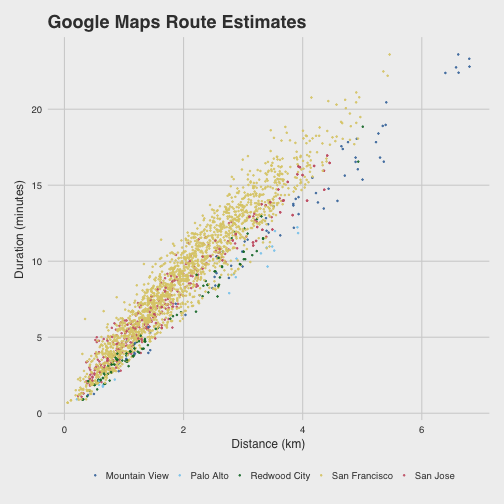
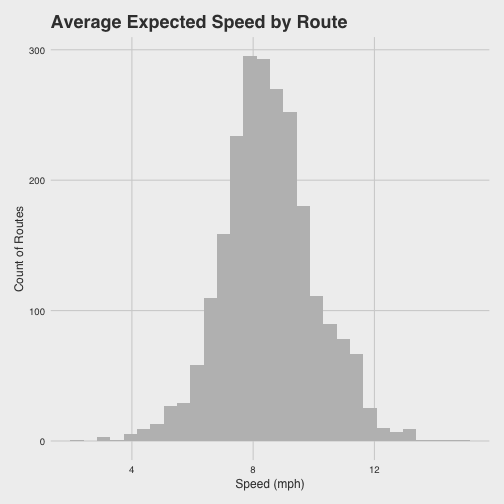
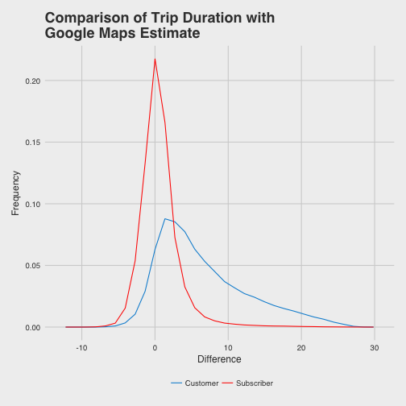
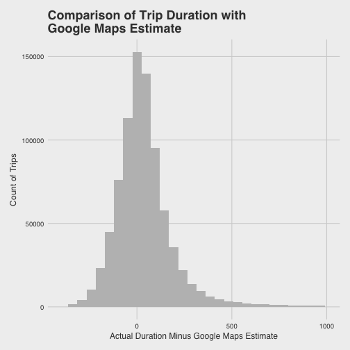
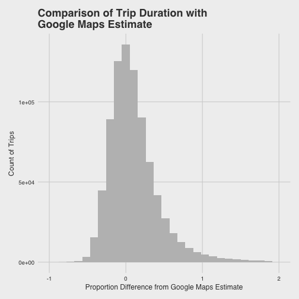
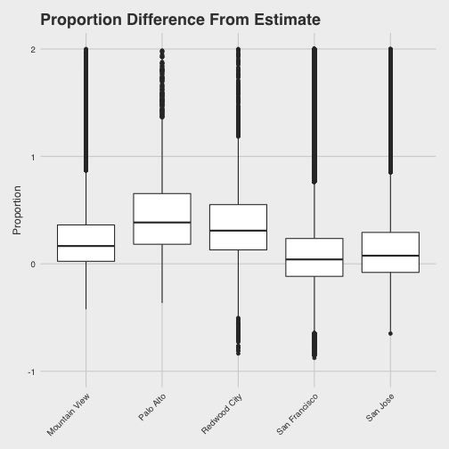
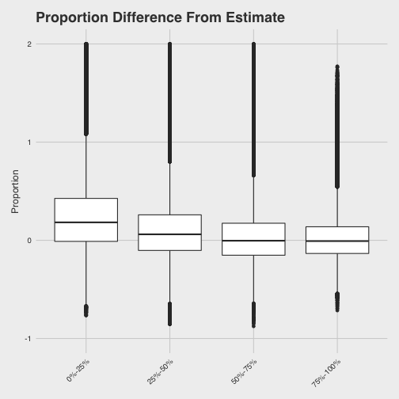

I like riding my bike for transportation whenever possible, and I often use Google Maps to find a route that is both safe and direct. However, their cycling directions sometimes seem a bit off, and I have often wondered how accurate the time estimates actually are for the average cyclist. This skepticism has been echoed by [others](http://www.betterbybicycle.com/2014/09/how-accurate-are-google-maps-cycling.html) as well.

Recently, I have been experimenting with data from the Bay Area Bike Share (BABS) system -- a network of shared bikes docked at stations scattered around the Bay Area. In this analysis, I compare actual trip times from the BABS to Google Maps time estimates to investigate their accuracy.

## Data

### BABS

The BABS makes trip data publically available [here](http://www.bayareabikeshare.com/open-data). It consists of individual records for 983,648 trips made between 8/2013 and 8/2016 complete with information like origin, destination, duration, start time, and more.

There are five different cities served by the system: San Francisco, Redwood City, Palo Alto, Mountain View, and San Jose. While it is possible to take a bike between cities, I filter those trips out because of their rarity and the likelihood that a trip from San Francisco to Palo Alto, for example, includes a stint on the Caltrain.

Below is a histogram of the actual duration of these trips. It is cut off at 30 minutes, but there are some trips that take significantly longer. These outliers are dealt with later. The distribution is skewed off to the right as we would expect since a cyclist can take an arbitrarily long amount of time to complete their trip.

### Google Maps Estimates

Through the Google Maps Directions API, I pull cycling estimates for every pair of stations in the same city. See [here](https://github.com/llefebure/bike-sharing/blob/master/R/google-api-trip-estimates.R) for the full code that generates those numbers. In addition, some stations changed location, so certain routes affected by this have multiple estimates with corresponding date ranges.

The relationship between the cycling distance (in meters) of a trip and its expected duration (in seconds) as reported by Google Maps is plotted below for each route. There is clearly a strong linear trend with some heteroskedasticity. As trips increase in distance, the variance of their expected duration increases. Trips range in distance from about 50 meters to 6,000 meters and in duration from about 10 seconds to 23 minutes.

From this data, I infer the expected average cycling speed for each route by scaling the ratio of duration and time. This distribution is shown below. The average expected speed of a route is between 8 and 9 miles per hour.

## Removing Major Outliers

My ultimate goal is to compare actual trip times with Google Maps estimates, so I need to filter out trips that were not continuous point to point journeys. For example, it is possible that a tourist stops several times to take photos before reaching their destination. Trips such as these could very easily skew the analysis. A quick look at the distribution of trip times (in seconds) reveals at least one obvious outlier.

| Min| First Quartile| Median|     Mean| Third Quartile|      Max|
|---:|--------------:|------:|--------:|--------------:|--------:|
|  60|            345|    510| 844.5574|            727| 17270400|

Clearly nobody made a continuous trip of over 17,000,000 seconds, which equates to approximately 200 days. However, finding the not so obvious discontinuous trips is more challenging. The BABS imposes overage charges on any trip that lasts longer than 30 minutes, so the system is setup to discourage those longer, discontinuous journeys. As a first step, I will filter out all trips longer than 30 minutes.

There is an additional piece of important information attached to each trip -- the subscriber type. This tells us more about the rider. Subscribers are those with annual or 30 day memberships, and customers are those with 24 hour or 3 day passes. I expect that subscribers are those that use the system for mostly commuting and transportation (the trips we are interested in), while customers can include tourists who use the system for exploring the area. Plotted below are the distributions of the difference between a trip's actual time and its estimated time by subscriber type. As expected, customers ride slower than subscribers. I filter out these trips as well.

## Analysis

The remaining dataset now has all trips shorter than 30 minutes made by subscribers. In the analysis that follows, I work with this dataset and explore descriptive statistics, particularly the median. Because the distribution of trip times is heavily skewed to the right and some outliers inevitably remain, the median is a more meaningful gauge of the "average" or "typical" trip than the mean itself.

The distribution of the difference (in seconds) between the actual and estimated time of each trip is shown below. The median is just 21 seconds, suggesting that the Google Maps estimates are quite good. These 21 seconds could simply be the overhead amount of time that it takes to check the bike in and out on either end of the trip. Despite the long right tail, the quartiles are nearly perfectly symmetric as well -- the middle 50% of trips were within just over one minute of the median.

|  Min| First Quartile| Median|    Mean| Third Quartile|  Max|
|----:|--------------:|------:|-------:|--------------:|----:|
| -622|            -51|     21| 41.0796|             98| 1739|

However, trips vary in length significantly. A one minute difference for a five minute trip is much different than a one minute difference for a twenty minute trip. Instead of looking at the difference between the actual and estimated times, I look at this difference scaled by the expected time below. Some outliers were missed, but the distribution is still remarkably symmetric. The median trip is just 5% longer than estimated.

|        Min| First Quartile|    Median|      Mean| Third Quartile|      Max|
|----------:|--------------:|---------:|---------:|--------------:|--------:|
| -0.8756856|     -0.1083871| 0.0521597| 0.1527389|      0.2560241| 42.41463|

Next, I segment the trips by city. Note that the vast majority of trips were in San Francisco and that the two cities with the highest usage, SF and San Jose, match the Google Maps estimates most closely. In the other cities, the estimates don't match with the actual trip times very well, however the service in these cities was eventually discontinued suggesting that usage never really took off there.

|City          | Count of Trips| Proportion of Total| Median Difference From Estimated Duration (proportion)| Median Difference From Estimated Duration (s)|
|:-------------|--------------:|-------------------:|------------------------------------------------------:|---------------------------------------------:|
|Mountain View |          20137|           0.0242015|                                              0.1706161|                                            41|
|Palo Alto     |           5240|           0.0062976|                                              0.3989637|                                           109|
|Redwood City  |           3789|           0.0045538|                                              0.3289474|                                           112|
|San Francisco |         760192|           0.9136297|                                              0.0441989|                                            18|
|San Jose      |          42699|           0.0513174|                                              0.0827815|                                            29|

Finally, I segment the trips by their expected distance to determine whether the accuracy of estimates differs between shorter and longer trips. The 0%-25% bucket contains, for example, all trips for which the Google Maps estimate was among the shortest quarter. The plots below show that the estimates for shorter trips are slightly too fast and those for longer trips are a bit slow. Two factors that could account for this difference are:

* Only better and faster cyclists attempt longer journeys on the bike, making those estimates seem too slow.
* The overhead amount of time that it takes to check out a bike, possibly adjust the seat, and check in the bike at the other end impacts shorter journeys more, making those estimates seem too fast.

|Quartile Bucket | Median Difference From Estimated Duration (proportion)| Median Difference From Estimated Duration (s)|
|:---------------|------------------------------------------------------:|---------------------------------------------:|
|0%-25%          |                                              0.1958763|                                            41|
|25%-50%         |                                              0.0639269|                                            24|
|50%-75%         |                                             -0.0037244|                                            -2|
|75%-100%        |                                             -0.0077067|                                            -6|

## Conclusion

Google Maps estimates seem to be very accurate for the median rider in San Francisco. When segmented out by trip distance, the estimates were slightly too fast for shorter routes and too slow for longer routes. This analysis gives some quantitative intuition about urban cycling estimates in the Bay Area, but I cannot make broader conclusions because the data was restricted to subscribers in the BABS on very specific and short, urban routes. It is quite possible that Google even uses this data to calibrate their models. They probably want their estimates to be as accurate as possible in their backyard!

One factor that could have skewed these results is missed outliers (trips that were not continuous point to point journeys). As discussed previously, I removed some of these trips because of their unrealistically long length, but there are definitely some that were missed. It is possible that there exists outliers on the other end of the spectrum too -- trips that were unrealistically short. The BABS employs rebalancers that drive around and redistribute bikes to different stations in the system. I could not figure out whether these types of "trips" are included in the dataset or not, but their presence would certainly be probelmatic. Despite all of these issues, I think that the median still gives a realistic picture because it is relatively resistant to outliers.

Now when I use Google Maps for cycling directions to get somewhere, I have some quantitative intuition as to their time accuracy. I will put aside ego, honestly assess how much better (or worse) than the median rider I think I am on that day, and extrapolate accordingly!
